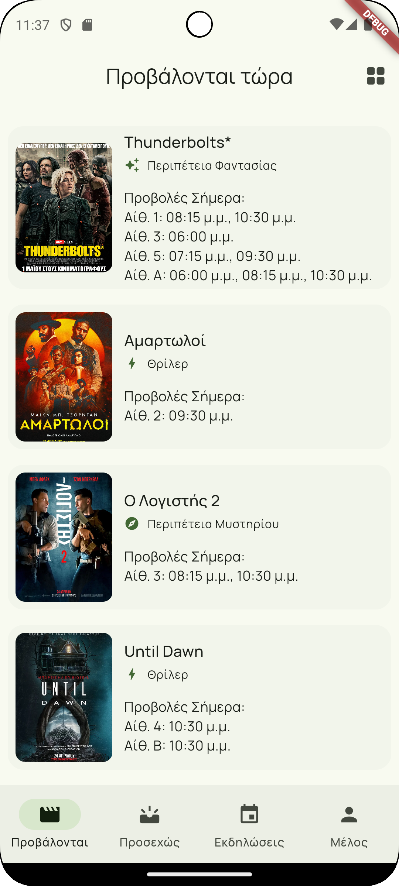
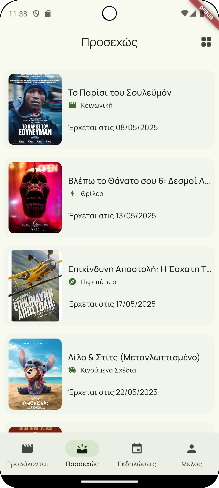
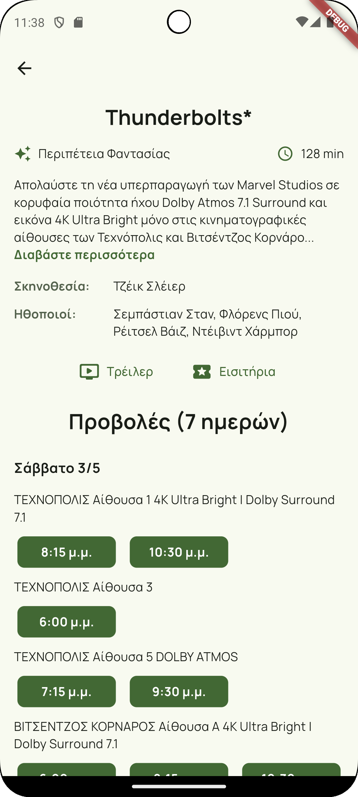
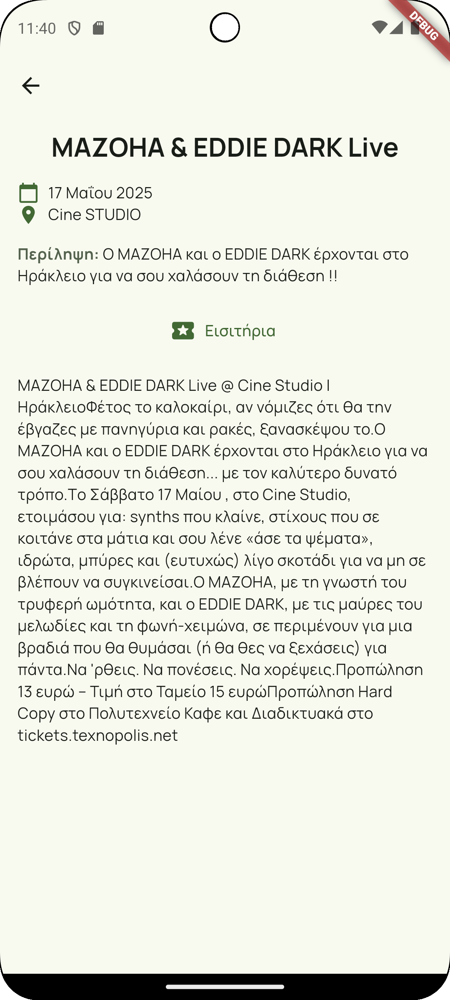
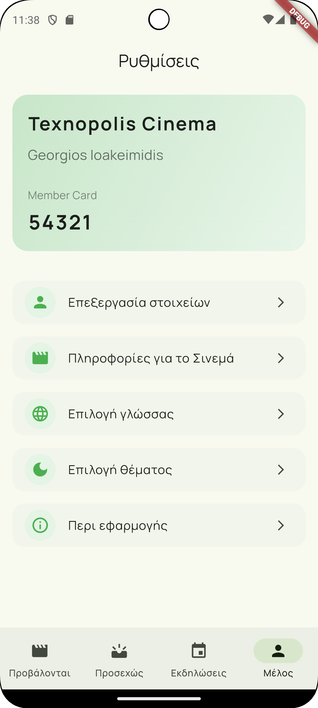

# 🎬 Texnopolis Cinema App (Redesign)

A modern, redesigned Flutter app for **Texnopolis**, a local cinema, built to provide a cleaner, more intuitive movie browsing experience for users.

## ✨ About

This project is a complete visual and UX overhaul of the original Texnopolis cinema app. The goal is to modernize the interface while preserving core functionality—making it easier for users to browse upcoming screenings and events.

## 📱 Features

* 🎟️ View upcoming screenings with event titles, dates, and venues
* 📍 Display theater name and location with intuitive icons
* 🧾 View detailed movie/event descriptions and summaries
* 👶 Indicator for family-friendly content
* 🔗 Ticket button to official ticket site
* 📆 Dates formatted with localized styles
* 🌐 Greek and English language support
* 🖼️ Responsive layout with Material Design 3 aesthetics

## 🖼️ Screenshots

| Now Showing                                 | Coming Soon | Movie Details |
|---------------------------------------------|--------------|--------------|
|  |  |  |

| Events                            | Event Details | Settings |
|-----------------------------------|--------------|--------------|
|  |  |  |


## 🚀 Build and Run

Clone and run the app locally:

```bash
git clone https://github.com/giorgosioak/texnopolis.git
cd texnopolis
flutter pub get
flutter run
```

Build the app:

```bash
flutter gen-l10n # generate localization files
flutter build apk --release
```

## 📂 Folder Overview

```
lib/
├── l10n/               # Localization files
├── models/             # Data models (e.g., Event)
├── providers/           # Locale and Theme providers
├── screens/            # UI screens like EventDetailScreen
├── services/           # API Service
├── util/               # Utilities
├── widgets/            # Reusable components
└── main.dart           # Entry point
```

## 🙌 Credits

Redesigned and developed by **Georgios Ioakeimidis**

Original content and event data from [**Texnopolis Cinema**](https://www.texnopolis.net/)


## 📬 Feedback & Contributions

Feel free to open issues or submit pull requests for improvements.

